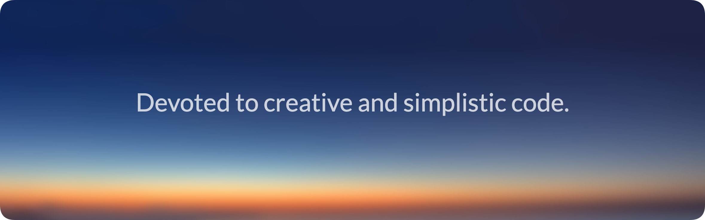

# Hi there, my name is <a href="http://kasjanhinc.com/">Kasjan Hinc</a> 

I am a creative developer and team player with great communication. I have been exposed to a wide variety of modern technologies and believe to have an understanding of full stack development and consider myself to be very adaptable. I’m looking for a role where I can expand my knowledge and work on modern technologies and languages.

## Technologies & Languages

- HTML & CSS (Bootstrap, Responsive, Flexbox, Animations, Forms)
- JavaScript ES6 (Vanilla, jQuery plugins, JSON)
- React (Hooks, Express, JSX, Webpack, Babel)
- Node, JSON web token, Axios, Bcrypt
- SQL (PostgreSQL, SQLAlchemy, Marshmallow)
- NoSQL (MongoDB, Mongoose)
- REST API's
- Python (Vanilla, Flask, Pipenv)
- Git (GitHub, Work flow, project deployment)

🥅 My goal for 2021 is to find a frontend role in a creative company.

📘 <a href="http://kasjanhinc.com/">My portfolio</a>

🔗  <a href="https://www.linkedin.com/in/kasjan-hinc/">My LinkedIn</a>

